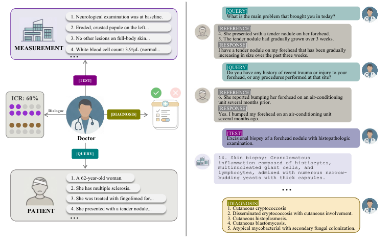
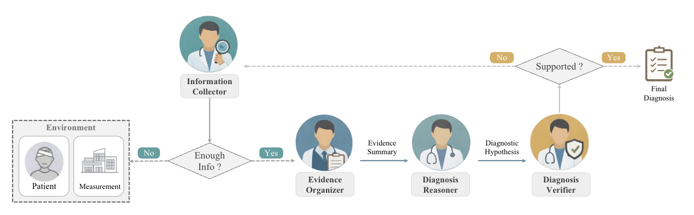
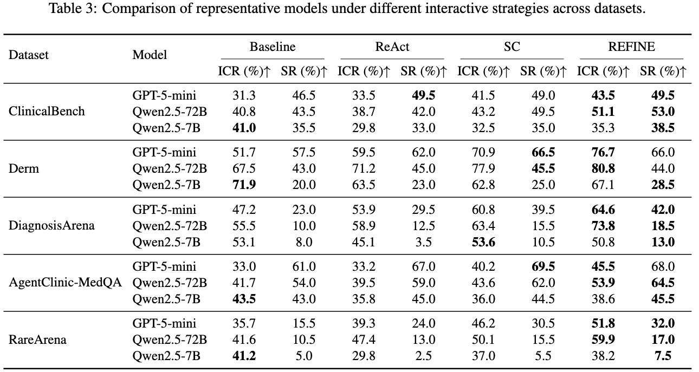

# EID-Benchmark

## Overview

Medical diagnosis requires not just reasoning ability, but also the skill to systematically gather relevant clinical information through patient interviews and diagnostic tests. This benchmark evaluates:

- **Information Collection Rate (ICR)**: How effectively does the model gather available clinical evidence?
- **Success Rate (SR)**: How accurately does the model arrive at the correct diagnosis?
- **Evidence-Outcome Correlation**: Does collecting more evidence actually improve diagnostic accuracy?

## Framework

The evaluation framework simulates realistic clinical scenarios where the doctor agent interacts with patient and measurement simulators to gather evidence before making a diagnosis:

<div align="center">

</div>

The framework consists of:
- **Patient Simulator**: Responds to doctor's queries based on case information
- **Measurement Simulator**: Returns lab/imaging results when requested
- **Doctor Agent**: Collects evidence through multi-turn interactions and provides diagnosis
- **Evaluator**: Computes ICR (coverage of available evidence) and SR (diagnostic accuracy)

## Evaluation Modes

| Mode | Description |
|------|-------------|
| `cot` | Chain-of-Thought: Single-pass diagnosis from case description |
| `roleplay` | Basic multi-turn interaction with patient/measurement simulators |
| `react` | ReAct: Explicit reasoning before each action |
| `sc` | Summarized-Conversation: Summarizer + Diagnostician pipeline |
| `refine` | REFINE: Verification loop with feedback for incomplete evidence |

### REFINE: Multi-Agent Diagnostic Framework

The REFINE mode implements a sophisticated multi-agent system with evidence verification and iterative refinement:

<div align="center">

</div>

**Key components:**
- **Information Collector**: Interacts with patient/measurement to gather evidence
- **Evidence Organizer**: Structures collected information into coherent summaries
- **Diagnosis Reasoner**: Generates diagnostic hypotheses based on evidence
- **Diagnosis Verifier**: Validates hypotheses and identifies missing evidence


## Installation

```bash
# Clone the repository
git clone https://github.com/your-username/eid-benchmark.git
cd eid-benchmark

# Create virtual environment with uv (recommended)
uv venv --python 3.12
source .venv/bin/activate

# Install dependencies
uv pip install -e .

```

## Configuration

1. Copy the example environment file:
```bash
cp .env.example .env
```

2. Edit `.env` with your API credentials:
```bash
# OpenAI-Compatible API Configuration
OPENAI_API_BASE_URL=https://api.openai.com/v1
OPENAI_API_KEY=your-api-key-here
```

## Quick Start

### Running Evaluations

```bash
# Basic CoT evaluation
eid-eval --datasets medqa --modes cot \
    --doctor-model gpt-5-mini \
    --max-items 2

# Multi-turn roleplay
eid-eval --datasets diagnosisarena --modes roleplay \
    --doctor-model gpt-5-mini \
    --max-turns 16 \
    --max-items 2

# ReAct with explicit reasoning
eid-eval --datasets medqa diagnosisarena --modes react \
    --doctor-model gpt-5-mini \
    --max-turns 12

# Full evaluation with parallel workers
eid-eval --datasets medqa diagnosisarena clinicalbench rarearena derm \
    --modes cot roleplay react sc refine \
    --doctor-model gpt-5-mini \
    --max-turns 8 12 16 \
    --max-items 200 \
    --max-workers 50
```

> **Note**: The `clinicalbench` dataset is not publicly available due to distribution restrictions.

### Model Configuration

Models are specified by name only (e.g., `gpt-5-mini`). The API endpoint is configured via environment variables.

**Role-specific models:**
```bash
# Different models for different roles
eid-eval --datasets diagnosisarena --modes roleplay \
    --doctor-model gpt-5-mini \
    --patient-model gpt-5-mini \
    --measurement-model gpt-5-mini \
    --max-turns 16
```

**SC/REFINE specific roles:**
```bash
# Specify summarizer, diagnostician, and verifier models
eid-eval --datasets diagnosisarena --modes sc refine \
    --doctor-model gpt-5-mini \
    --summarizer-model gpt-5-mini \
    --diagnostician-model gpt-5-mini \
    --verifier-model gpt-5-mini \
    --max-turns 16
```

### Analyzing Results

```bash
# E1: Overall performance summary with scatter plots
eid-analyze e1 --datasets medqa diagnosisarena \
    --modes cot react refine \
    --models gpt-5-mini \
    --max-turns 16 \
    --fig-dir figures --excel results/summary.xlsx

# E2: Turn limit experiments
eid-analyze e2 --datasets diagnosisarena \
    --modes react refine \
    --models gpt-5-mini \
    --max-turns 4 8 12 16 \
    --fig-dir figures

# E3: Coverage vs outcome analysis
eid-analyze e3 --datasets diagnosisarena rarearena \
    --modes react refine \
    --models gpt-5-mini \
    --max-turns 16 \
    --fig-dir figures

# E4: Ablation study
eid-analyze e4 --datasets medqa diagnosisarena \
    --modes roleplay react refine \
    --models gpt-5-mini \
    --max-turns 16 \
    --baseline roleplay --md figures/ablation.md

# Average turns analysis
eid-analyze turns --datasets medqa diagnosisarena \
    --modes roleplay react sc refine \
    --models gpt-5-mini \
    --max-turns 16 \
    --md figures/turns.md
```

## Results

The benchmark demonstrates that strong reasoning capabilities alone are insufficient for interactive diagnosis. Systematic evidence elicitation significantly improves diagnostic accuracy:

<div align="center">

</div>

**Key findings:**
- **REFINE consistently outperforms baselines** across all datasets, showing the importance of verification-guided evidence collection
- **ICR-SR correlation**: Higher information collection rates strongly correlate with diagnostic success
- **Model differences**: Larger models (e.g., GPT-5-mini) show better reasoning but may still benefit from structured evidence elicitation

See the table above for detailed performance metrics across different models and interactive strategies.

## Project Structure

```
eid-benchmark/
├── src/eid/                    # Main evaluation framework
│   ├── agents/                 # CAMEL ChatAgent wrappers
│   ├── scenarios/              # Evaluation scenarios (cot, roleplay, etc.)
│   ├── datasets/               # Dataset loaders
│   ├── metrics/                # Evaluation metrics
│   ├── prompts/                # Prompt templates
│   ├── config.py               # Configuration management
│   ├── benchmark.py            # Main Benchmark class
│   └── cli.py                  # Command-line interface
├── analyze/                    # Analysis and visualization tools
│   ├── cli.py                  # Analysis CLI (E1-E4 experiments)
│   ├── runner.py               # Result loading and aggregation
│   ├── metrics.py              # Coverage computation
│   ├── plots.py                # Visualization functions
│   └── models.py               # Data models
├── data/                       # Dataset files (JSONL format)
├── results/                    # Evaluation outputs
├── figures/                    # Generated plots
├── .vscode/                    # VSCode debug configurations
├── .env.example                # Environment template
├── pyproject.toml              # Project configuration
└── README.md
```


## Citation

If you use this benchmark in your research, please cite:

```bibtex
@article{eid2025,
  title={Strong Reasoning Isn't Enough: Evaluating Evidence Elicitation in Interactive Diagnosis},
  author={Zhuohan Long, Zhongyu Wei},
  journal={arXiv preprint},
  year={2025}
}
```

## License

This project is licensed under the MIT License - see the [LICENSE](LICENSE) file for details.
